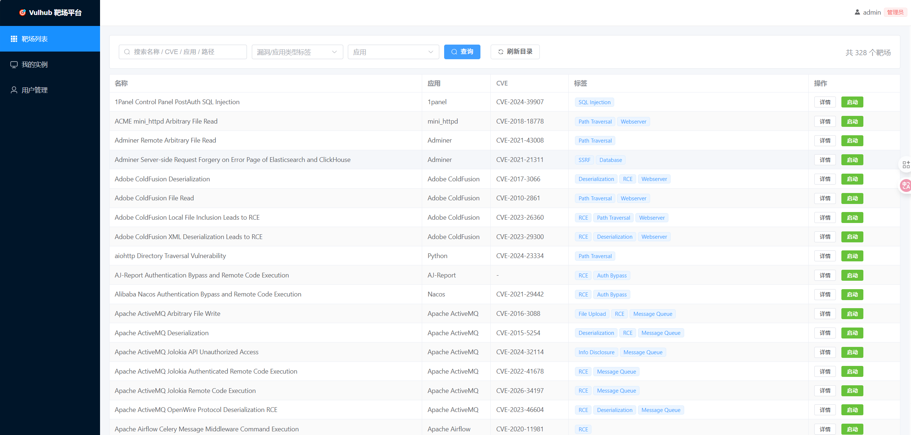

# Vulhub Hub

<p align="center">
  
</p>

[](LICENSE)
[](https://github.com/shaomian/vulhub-hub/stargazers)
[](https://docs.docker.com/compose/)

**语言 / Language**: [English](README.md) | **中文**

基于 Web 的漏洞靶场管理平台，用于浏览、启动、停止和监控本地 [vulhub](https://github.com/vulhub/vulhub) 漏洞环境。

- **后端**：FastAPI + SQLAlchemy(SQLite) + JWT 鉴权，通过 `docker compose` 管理容器。
- **前端**：Vue 3 + Vite + Element Plus + Pinia。
- **功能**：多用户鉴权、靶场目录检索（名称/CVE/应用/标签）、README 与 compose 预览、一键启停、实时端口/访问地址、容器日志、用户管理、每用户并发实例限制、**实例超时自动停止（页面实时倒计时）+ 手动续期 + 管理员可配置超时时间**。
- **部署**：支持单容器 Docker 一键部署（`docker compose up -d --build`），并提供 **Linux / macOS（`deploy.sh`）与 Windows（`deploy.ps1`）一键部署脚本**，详见 [Docker 部署（单容器）](#docker-部署单容器) 与 [一键部署（Linux / macOS / Windows）](#一键部署linux--macos--windows)。

## 快速开始（Quick Start）

前置条件：目标主机已安装 **Docker** 与 **docker compose**（若未安装，`deploy` 脚本会尝试自动安装）。

```bash
# 1. 克隆本仓库
git clone https://github.com/shaomian/vulhub-hub.git
cd vulhub-hub

# 2. 一键部署（自动：缺失时安装 Docker、克隆 vulhub、生成随机密钥与随机管理员密码、构建并启动）
#    Linux:   sudo ./deploy.sh
#    macOS:   ./deploy.sh
#    Windows: powershell -ExecutionPolicy Bypass -File .\deploy.ps1

# 3. 浏览器访问 http://<宿主机 IP>:8000
#    使用脚本结束时一次性打印的管理员账号 / 密码登录（也可在 .env 中查看）
```

日常运维（仅作用于平台容器）：

```bash
./manage.sh restart     # 重启平台（Windows: .\manage.ps1 restart）
./manage.sh pull        # git pull 更新 vulhub 靶场后自动重启
./manage.sh logs        # 跟随日志
```

> 想手动、分步或了解跨平台细节，请继续阅读下文。

## 目录结构

```
vulhub-hub/
├── backend/            # FastAPI 后端
│   ├── app/            # 应用代码 (routers/services/models...)
│   ├── requirements.txt
│   └── .env.example    # 配置模板
└── frontend/           # Vue3 前端
```

## 环境要求

- Python 3.10+
- Node.js 18+
- Docker Desktop（已启用 `docker compose`）
- 同级目录下存在 `vulhub/`（靶场来源，可通过 `VULHUB_ROOT` 调整）；若缺失，`deploy` 脚本会自动 `git clone` 拉取

## 本地开发（可选）

不使用 Docker 时，可分别启动后端与前端：

```powershell
# 后端 -> http://127.0.0.1:8000（API 文档在 /docs）
cd vulhub-hub/backend
python -m venv .venv
.\.venv\Scripts\python.exe -m pip install -r requirements.txt
Copy-Item .env.example .env
.\.venv\Scripts\python.exe -m uvicorn app.main:app --host 127.0.0.1 --port 8000

# 前端 -> http://localhost:5173
cd ../frontend
npm install
npm run dev        # 生产构建：npm run build -> frontend/dist
```

首次启动会自动创建 SQLite 数据库并初始化管理员账户。

## Docker 部署（单容器）

单容器方式由后端同时提供 API 与前端静态资源（同源，无需配置 CORS），并通过挂载宿主机 Docker 套接字（DooD）驱动宿主机的 Docker 守护进程来启停 vulhub 靶场。

前置条件：宿主机已安装 Docker 与 `docker compose`；同级目录存在 `vulhub/`（compose 默认以 `../vulhub` 作为挂载源，缺失时 `deploy` 脚本会自动 `git clone` 拉取）。

```powershell
cd vulhub-hub
docker compose up -d --build
```

默认监听 `http://<宿主机>:8000`，使用[默认账户](#默认账户)登录。SQLite 数据库持久化在名为 `range-data` 的卷中，容器重建不会丢失数据。

部署后可快速验证：

```powershell
# 健康检查：返回 {"status":"ok","environments":<已加载靶场数>}
Invoke-RestMethod http://localhost:8000/api/health

# 查看容器状态与实时日志
docker compose ps
docker compose logs -f
```

**可配置项**（可选，在 `vulhub-hub/` 下创建 `.env` 覆盖）：

| 变量                     | 说明                             | 默认值            |
| ------------------------ | -------------------------------- | ----------------- |
| `PLATFORM_PORT`          | 宿主机映射端口                   | 8000              |
| `SECRET_KEY`             | JWT 签名密钥（生产必改）          | change-me...      |
| `ADMIN_USERNAME`         | 初始管理员用户名                 | admin             |
| `ADMIN_PASSWORD`         | 初始管理员密码                   | admin123          |
| `SERVER_HOST`            | 生成访问地址时使用的主机         | localhost         |
| `MAX_INSTANCES_PER_USER` | 普通用户最大并发实例数           | 3                 |
| `PORT_RANGE_START`       | 实例端口随机分配范围（起始）     | 10000             |
| `PORT_RANGE_END`         | 实例端口随机分配范围（结束）     | 12000             |
| `INSTANCE_DEFAULT_TTL_MINUTES` | 实例默认超时时间（分钟）；首次启动写入数据库，之后管理员可在「系统设置」中在线调整 | 60  |
| `INSTANCE_MAX_TTL_MINUTES`     | 普通用户单次续期上限（分钟）；首次启动写入数据库，之后管理员可在线调整 | 1440 |
| `CORS_ORIGINS`           | 额外允许的跨域来源（同源无需）   | 空                |
| `VULHUB_HOST_PATH`       | 宿主机 vulhub 目录（挂载源）      | ../vulhub         |
| `VULHUB_MOUNT`           | 容器内 vulhub 挂载路径            | /vulhub           |

> `SERVER_HOST` 应设置为浏览器可访问到的地址（如服务器 IP 或域名），否则「访问地址」链接会指向 localhost。

**关于绑定挂载的路径一致性（重要）**：靶场由宿主机 Docker 守护进程启动。若某个 vulhub 的 `docker-compose.yml` 使用相对路径 bind mount（如 `./conf:/etc/conf`），compose 会将其解析为容器内看到的路径再交给宿主机守护进程挂载，导致该路径在宿主机上不存在而启动失败。解决办法是让容器内挂载路径与宿主机绝对路径完全一致：

```powershell
# 例：宿主机 vulhub 绝对路径为 /opt/vulhub
$env:VULHUB_HOST_PATH="/opt/vulhub"
$env:VULHUB_MOUNT="/opt/vulhub"
docker compose up -d --build
```

多数仅构建镜像 / 映射端口的靶场无需此设置。

更新平台（后端 / 前端代码变更后重建镜像并重启）：`docker compose up -d --build`。

停止平台：`docker compose down`（追加 `-v` 会一并删除 `range-data` 数据库卷）。

## 服务管理（启动 / 停止 / 重启）

部署完成后，可用管理脚本封装 `docker compose` 便捷地启停平台服务（**仅作用于平台容器**；运行中的 vulhub 靶场为独立 compose 项目，不受这些命令影响）。

**Linux / macOS（`manage.sh`）**：

```bash
cd vulhub-hub
chmod +x manage.sh
./manage.sh restart      # 重启平台（Linux 会自动加 sudo）
```

**Windows（`manage.ps1`）**：

```powershell
cd vulhub-hub
powershell -ExecutionPolicy Bypass -File .\manage.ps1 restart
```

支持的命令（两个脚本一致）：

| 命令 | 说明 |
| ---- | ---- |
| `start`           | 启动平台（容器不存在则创建，幂等） |
| `stop`            | 停止平台容器（保留容器与数据卷） |
| `restart`         | 重启平台容器 |
| `status`（`ps`）  | 查看容器状态 |
| `logs`            | 跟随平台日志（`--tail=200`，Ctrl-C 退出） |
| `rebuild`（`update`）| 重建镜像并重启（后端/前端代码变更后使用） |
| `down`            | 移除平台容器（保留 `range-data` 数据卷） |
| `destroy`         | 移除容器并删除 `range-data` 卷（**会清空数据库**，需输入 `yes` 二次确认） |

> 更完整的功能与改动点清单见 [`CHECKLIST.md`](CHECKLIST.md)。

## 一键部署（Linux / macOS / Windows）

平台镜像在**目标主机上本地构建**，跨操作系统无需迁移产物。三大主流系统均提供一键脚本：

| 系统 | 脚本 | Docker 来源 |
| ---- | ---- | ----------- |
| Linux（各主流发行版）| `deploy.sh` | 脚本按发行版自动安装 Docker Engine + compose 插件 |
| macOS | `deploy.sh` | Docker Desktop（缺失时经 Homebrew `brew install --cask docker` 安装并启动）|
| Windows | `deploy.ps1` | Docker Desktop（缺失时经 `winget` 安装，需手动启动后重跑）|

### 方式一：一键脚本（推荐）

**Linux / macOS** —— 将本仓库同步到主机后执行（脚本用 `uname` 识别系统；Linux 自动识别发行版选择安装方式）：

```bash
cd vulhub-hub
chmod +x deploy.sh
sudo ./deploy.sh      # macOS 无需 sudo：./deploy.sh
```

> macOS 说明：脚本依赖 Docker Desktop。若未安装，会尝试 `brew install --cask docker`；安装后脚本会 `open -a Docker` 启动并等待守护进程就绪。macOS 上**不要用 sudo** 运行（Docker Desktop 以当前用户身份运行）。

**Windows** —— 在 PowerShell 中执行（需 Docker Desktop，WSL2 或 Hyper-V 后端）：

```powershell
cd vulhub-hub
powershell -ExecutionPolicy Bypass -File .\deploy.ps1
```

> Windows 说明：若未安装 Docker，脚本会用 `winget install -e --id Docker.DockerDesktop` 安装，随后请**手动启动 Docker Desktop 并完成首次初始化**，再重跑脚本。`deploy.ps1` 与 `deploy.sh` 行为一致：随机 `SECRET_KEY`/管理员密码、写 `.env`、`docker compose up -d --build`、一次性打印凭据。

脚本会自动：检测发行版 → 缺失时安装 Docker 与 compose 插件并设为开机自启 → 生成 `.env`（随机 `SECRET_KEY`、**随机管理员密码**、自动填入本机 IP 作为 `SERVER_HOST`、把 vulhub 以**同路径**挂载）→ `docker compose up -d --build` → 输出访问地址、健康检查命令，并**一次性打印本次生成的管理员账号密码**（请立即记录，之后仅可在 `.env` 中查看）。重复执行是幂等的：已存在的 `.env` 不会被覆盖，管理员密码也不会改变。

脚本自动识别发行版并安装 Docker 与 compose v2 插件——覆盖 Debian/Ubuntu/Kali/Mint（apt）、RHEL/CentOS/Rocky/Alma/Oracle/Fedora/Amazon Linux（dnf/yum）、openSUSE/SLES（zypper）、Arch/Manjaro（pacman）、Alpine（apk），其它发行版回退到 `get.docker.com`；缺失 compose 插件时会从 GitHub Releases 补齐，并同时兼容 systemd 与 OpenRC。

> 随机密码仅在**首次部署（数据库为全新）**时生效——管理员账户在后端首次启动、数据库为空时按 `.env` 中的 `ADMIN_PASSWORD` 创建；此后即使修改 `.env` 也不会自动改动已存在账户的密码。

### 重置随机管理员密码

由于后端仅在**数据库为空**时才按 `.env` 的 `ADMIN_PASSWORD` 创建管理员，直接改 `.env` 里的密码并重启**不会**改动已存在账户。若要让脚本重新生成一个随机密码，需要连同数据库卷一起清空后重跑：

Linux / macOS：

```bash
cd vulhub-hub
sudo docker compose down -v   # macOS 去掉 sudo；-v 会删除 range-data 卷（含 SQLite 数据库），账户/实例记录一并清除
rm -f .env                    # 删除旧 .env，让脚本重新生成随机 SECRET_KEY 与随机管理员密码
sudo ./deploy.sh              # 重新部署，结束时会再次一次性打印新的管理员账号密码
```

Windows（PowerShell）：

```powershell
cd vulhub-hub
docker compose down -v        # 删除 range-data 卷（含数据库）
Remove-Item .env -ErrorAction SilentlyContinue
powershell -ExecutionPolicy Bypass -File .\deploy.ps1
```

> 若只想改密码而**保留现有数据**，请登录平台后在「用户管理」中修改，或用管理员账户走应用内的改密流程——不要用上面的 `-v` 命令，那会清空整个数据库。

### 方式二：手动步骤

一键脚本已自动完成以下所有操作；仅在脚本无法运行时才需手动执行。

1. **安装 Docker 与 compose 插件**：按[官方文档](https://docs.docker.com/engine/install/)选择你的发行版安装（Debian/Ubuntu/Kali 用 apt，RHEL/CentOS/Fedora 用 dnf 等），随后 `sudo systemctl enable --now docker`。macOS / Windows 直接安装并启动 [Docker Desktop](https://www.docker.com/products/docker-desktop/)。
2. **配置 `.env`**（关键：让 vulhub 在容器内外路径一致）：

   ```bash
   cd vulhub-hub
   VULHUB=$(cd ../vulhub && pwd)
   cat > .env <<EOF
   SECRET_KEY=$(openssl rand -hex 32)
   SERVER_HOST=$(hostname -I | awk '{print $1}')
   VULHUB_HOST_PATH=$VULHUB
   VULHUB_MOUNT=$VULHUB
   EOF
   ```
3. **构建并启动、验证**：

   ```bash
   sudo docker compose up -d --build
   curl -s http://localhost:8000/api/health   # 应返回 status ok 与靶场数量
   ```

### 跨平台差异与注意事项

- **镜像在目标机重建，无产物迁移**：每台主机各自 `docker compose up -d --build`，不依赖其它系统的构建产物，避免跨平台二进制问题。
- **bind mount 路径一致性（最重要，分系统）**：靶场由宿主机 Docker 守护进程启动，使用相对 bind mount（如 `./conf:/etc/conf`）的 vulhub 需要容器内路径与守护进程可解析的宿主机路径一致。
  - **Linux**：把 vulhub 以**相同绝对路径**挂载即可完全兼容（脚本已自动处理：`VULHUB_HOST_PATH=VULHUB_MOUNT=<绝对路径>`）。
  - **macOS**：同样可做到一致——将 `VULHUB_MOUNT` 设为该 vulhub 在 Mac 上的绝对路径（如 `/Users/you/.../vulhub`，并确保它在 Docker Desktop 的 File Sharing 范围内），`deploy.sh` 已按此处理。
  - **Windows**：宿主机路径是 `C:\...`，无法等同于容器内的 Linux 路径，因此**使用相对 bind mount 的靶场可能无法启动**；`deploy.ps1` 默认 `VULHUB_MOUNT=/vulhub`。**仅做端口映射**的靶场（大多数）不受影响，可正常启停。
- **Docker 套接字 / 引擎**：Linux 平台容器以 root 运行，直接访问 `/var/run/docker.sock`；macOS / Windows 由 Docker Desktop 提供该套接字，DooD 同样可用。
- **SELinux（CentOS/RHEL）**：enforcing 模式下，容器读取挂载目录或访问 docker.sock 可能被拒绝。若健康检查 `environments` 为 0 或日志出现 `permission denied`，执行 `sudo chcon -Rt container_file_t <vulhub 绝对路径>`；测试环境仍不行时可临时 `sudo setenforce 0`。
- **防火墙**：放行平台端口与各靶场端口。ufw：`sudo ufw allow 8000/tcp`；firewalld：`sudo firewall-cmd --add-port=8000/tcp --permanent && sudo firewall-cmd --reload`。
- **构建网络**：构建需访问 Docker Hub / npm / PyPI。受限网络请配置代理或镜像源；`npm ci` 偶发网络中断时，重试 `sudo docker compose build` 即可。
- **行尾必须为 LF**：`deploy.sh` 与 vulhub 的 `docker-compose.yml` 需为 LF 换行。若经 Windows 传输变成 CRLF，用 `sed -i 's/\r$//' deploy.sh` 修复。

## 默认账户

| 用户名 | 密码       | 角色  |
| ------ | ---------- | ----- |
| admin  | admin123   | 管理员 |

> 上表为本地开发/手动部署（未设置 `ADMIN_PASSWORD` 时）的默认凭据。**使用 `deploy.sh` 一键部署时，管理员密码为随机生成**，请以脚本结束时打印的（或 `.env` 中 `ADMIN_PASSWORD` 的）值为准。
>
> 生产环境请务必修改 `.env` 中的 `SECRET_KEY`、`ADMIN_PASSWORD`。

## 主要配置项（backend/.env）

| 变量                     | 说明                                   | 默认值                    |
| ------------------------ | -------------------------------------- | ------------------------- |
| `SECRET_KEY`             | JWT 签名密钥（务必修改）                | change-me...              |
| `DATABASE_URL`           | 数据库连接                             | sqlite:///./range_platform.db |
| `VULHUB_ROOT`            | vulhub 目录路径（相对 backend/）        | ../../vulhub              |
| `SERVER_HOST`            | 生成访问地址时使用的主机               | localhost                 |
| `ADMIN_USERNAME`         | 初始管理员用户名                       | admin                     |
| `ADMIN_PASSWORD`         | 初始管理员密码                         | admin123                  |
| `MAX_INSTANCES_PER_USER` | 普通用户最大并发运行实例数             | 3                         |
| `INSTANCE_DEFAULT_TTL_MINUTES` | 实例默认超时时间（分钟）。首次启动写入数据库，之后管理员可在「系统设置」中在线调整，无需重启 | 60  |
| `INSTANCE_MAX_TTL_MINUTES`     | 普通用户单次续期上限（分钟）。首次启动写入数据库，之后管理员可在线调整 | 1440 |
| `CORS_ORIGINS`           | 允许的前端来源（逗号分隔）             | http://localhost:5173,... |

## 使用流程

1. 登录后进入 **靶场列表**，可按名称 / CVE / 应用 / 标签搜索筛选。
2. 点击 **详情** 查看 README 与 `docker-compose.yml`。
3. 点击 **启动**，平台执行 `docker compose up -d` 并返回访问地址（宿主机端口）。
4. 在 **我的实例** 中查看状态、访问地址、日志，或停止 / 删除实例。每个运行中实例显示**实时倒计时**到自动停止时刻；点击 **续期** 可延后截止时间（普通用户受配置的最大续期时长约束）。
5. 管理员可在 **用户管理** 中创建 / 编辑 / 禁用用户，并查看所有用户的实例；在 **系统设置** 中可调整默认超时时间与最大续期时长。

## 实例超时自动停止与续期

为避免测试完成后忘记关闭环境，每个启动的实例都会被赋予一个自动停止截止时刻（`expires_at` = 启动时间 + 默认超时时长）：

- 后台有清理任务每 15 秒扫描一次，凡运行中实例超过截止时刻即执行 `docker compose down -v`（与手动停止一致）并标记为已停止。
- **我的实例** 页面按秒显示**倒计时**（不足 5 分钟变橙、不足 1 分钟变红），并每 30 秒自动刷新列表，自动停止后无需手动刷新即可看到状态变化。
- **续期**：在运行中实例上点击 **续期**，选择分钟数，截止时刻将重置为「当前时刻 + N 分钟」。普通用户单次续期时长受管理员配置的最大值约束；管理员可输入任意正数。
- **管理员配置**：在 **系统设置** 页面可调整 **默认超时时间**（作用于新启动的实例）与 **最大续期时长**（约束普通用户）。配置存入数据库、即时生效，无需重启。环境变量 `INSTANCE_DEFAULT_TTL_MINUTES` / `INSTANCE_MAX_TTL_MINUTES` 仅作为首次启动的初始值。
- 已在运行的实例在配置变更后仍保留原 `expires_at`，用户可按需通过 **续期** 延长。

## 添加与维护靶场

一个靶场能被平台使用，取决于两处：`environments.toml` 中登记的条目（决定能否被检索到）+ 对应目录下的 `docker-compose.yml`（决定能否启动）。

**同步官方 vulhub 新环境**：

```powershell
cd vulhub
git pull
```

**添加自定义靶场**（遵循 vulhub 约定：软件目录小写、CVE 目录大写、文件名必须 `docker-compose.yml`、LF 换行）：

1. 在 `VULHUB_ROOT` 下创建目录（如 `myapp/CVE-2025-0001/`）并放入 `docker-compose.yml`（可选 `README.md` / `README.zh-cn.md`）。
2. 在 `environments.toml` 末尾追加条目，`path` 必须与目录相对路径一致：

   ```toml
   [[environment]]
   name = "My App RCE"
   cve = ["CVE-2025-0001"]
   app = "myapp"
   path = "myapp/CVE-2025-0001"
   tags = ["RCE"]
   ```

   > `tags` 建议取自文件顶部 `tags = [...]` 中已定义的值，否则不会出现在筛选下拉框里。

**刷新目录（热重载）**：目录为内存缓存。修改上述内容后，管理员在 **靶场列表** 页点击「刷新目录」按钮即可生效，无需重启后端（等价接口：`POST /api/environments/reload`，仅管理员）。

## 说明与注意

- 每次启动都会生成唯一的 compose 项目名，并把靶场 `docker-compose.yml` 声明的宿主机端口重映射到 `PORT_RANGE_START`~`PORT_RANGE_END` 范围内的随机空闲端口；因此多个用户（或同一靶场多次启动）可并发运行、互不冲突，不再出现「Environment is already running」。启动后仍从 `docker compose ps` 读取实际映射端口。
- 每个实例都是独立、全新的容器与卷；停止实例执行 `docker compose down -v`，会移除该实例的容器、网络与卷，不会残留上一次测试的数据。
- 部分靶场镜像（如旧版 nginx）不向 stdout 输出日志，日志面板可能为空，属正常现象。
- 若某靶场在 `docker-compose.yml` 中固定了自定义网络子网（`ipam` 固定 subnet）等全局唯一资源，多实例并发时可能仍会冲突，属个别靶场的固有限制。
- Windows 下已针对 `docker` 子进程输出统一使用 UTF-8 解码，避免 GBK 编码报错。
